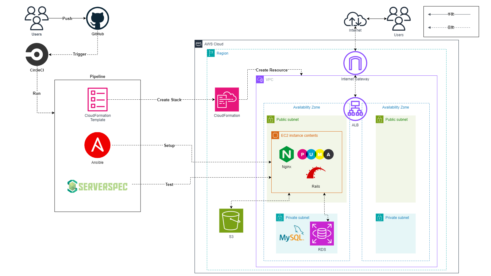

# RaiseTech AWSコース

## 概要
- 2024/3月から受講開始
- 最終課題としてCI/CDパイプラインを用いたRailsアプリケーションのインフラストラクチャの自動構築と稼働の実施
- 学習記録の掲載

### 実施内容
1. AWS CloudFormationを使用して、VPC・EC2・RDS・ALB・S3を構築
2. Ansibleを用いて、Railsアプリケーション実行環境の自動構築
3. Serverspecを使用して、構築したサーバーの自動テストを実施
4. CircleCIを用いて、上記プロセスのパイプラインを構築と自動化
- 作成したファイルは[第13回課題リポジトリ](https://github.com/H-Takamisawa/lecture13_Raisetech)を参照

### インフラ構成図
- 最終的に構築した環境は下図の通りです。
 

### 学習記録
- RaiseTechで学習した講座概要と提出課題の対応は以下の通りです。 
|講座|概要|提出課題|補足|
|:---|:---|:---|:---|
|第1回|AWSアカウント作成 IAM設定 Cloud9の作成|該当なし|Discord上に提出のため反映無し|
|第2回|Gitの基礎学習 GitHubアカウントの作成 Pull Requestの練習|[lecture02.md](lecture02.md)|Cloud9のターミナルで実施|
|第3回|Webアプリケーションについて Cloud9でサンプルアプリケーション(Rails)のデプロイ|[lecture03.md](lecture03.md)||
|第4回|VPC,EC2,RDSの手動構築 EC2からRDSへの接続確認|[lecture04.md](lecture04.md)|以降、EC2への接続はTera Termを使用|
|第5回|手動でRailsアプリケーションの環境構築 ALB,S3の追加 AWS構成図の作成|[lecture05.md](lecture05.md)||
|第6回|AWSでの証跡、ロギング AWSでの監視、通知 AWSでのコスト管理|[lecture06.md](lecture06.md)|-|
|第7回|システムにおけるセキュリティの基礎 AWSのセキュリティ対策|[lecture07.md](lecture07.md)|-|
|第8回|第5回課題のライブコーディング|該当なし|-|
|第9回|第5回課題のライブコーディング|該当なし|-|
|第10回|Infrastructure as codeから成るインフラ自動化 CloudFormationの利用|[lecture10.md](./lecture10.md)|第5回で構築した環境のコード化 以降、IDEはVSCodeを使用|
|第11回|インフラのテスト Serverspecを用いた自動テスト|[lecture11.md](lecture11.md)|-|
|第12回|DevOps CI/CDツールについて CircleCIについて |[lecture12.md](lecture12.md)|-|
|補助資料|Terraformの基礎|該当なし|補助資料による個人学習のため課題無し|
|第13回|Ansibleの導入 CircleCIとの併用|[lecture13.md](lecture13.md)|-|
|第14回|第13回課題のライブコーディング|該当なし|-|
|第15回|第13回課題のライブコーディング|該当なし|-|
|第16回|現場へ出ていくにあたって必要な知識と技術、立ち振る舞いについて|該当なし|最終回|
