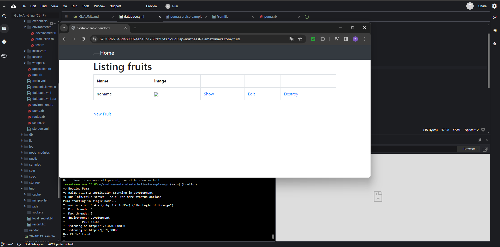
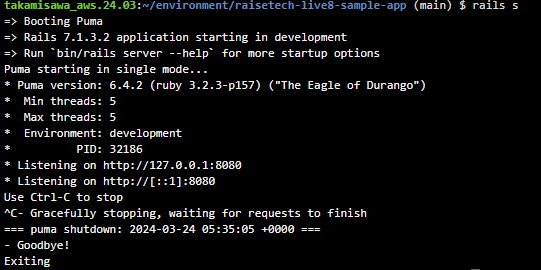
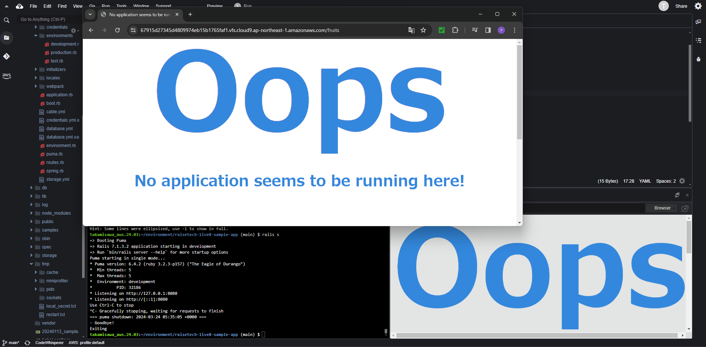
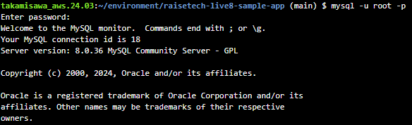
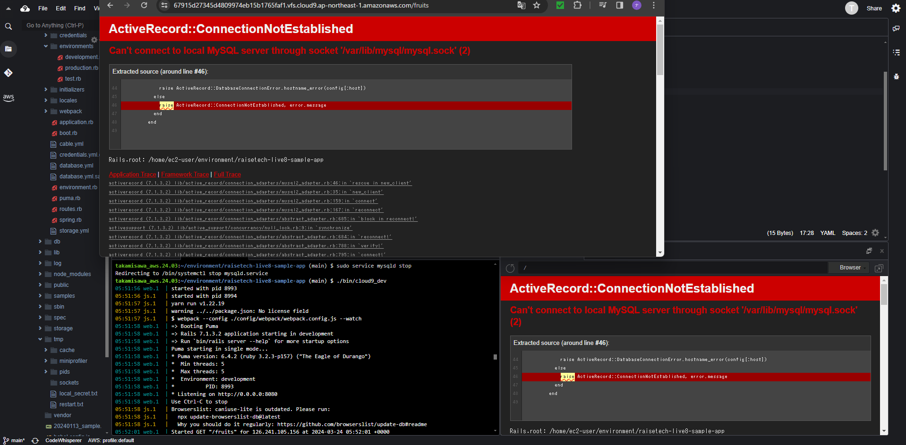
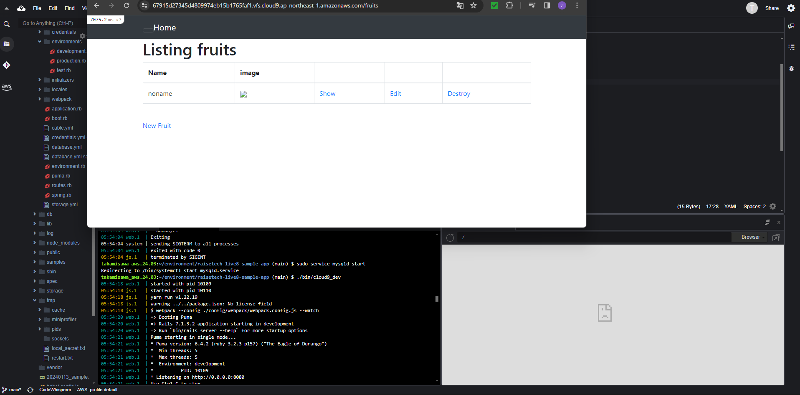
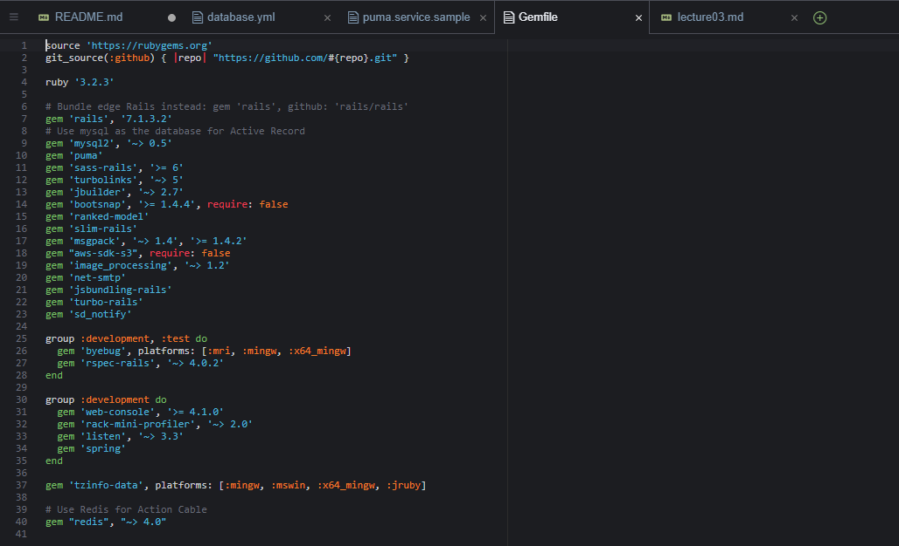

# 第3回課題

## 概要

1. APサーバーについての結果
2. DBサーバーについての結果
3. 感想

## 内容

### 1. APサーバーについての結果

- APサーバー起動時の画面

- APサーバーの名前：puma
- バージョン：6.4.2

- APサーバーを終了させた場合、引き続きアクセスできますか？   →アクセス不可

### 2. DBサーバーについての結果

- DBサーバーの名前：Mysql
- バージョン：8.0.36

- DBサーバーを終了させた場合、引き続きアクセスできますか？   →アクセス不可

- DBサーバーを再度起動したら、アクセス可能となりました。

- Railsの構成管理ツールの名前：Bundler

### 3.感想

- コマンド自体は短く理解できるものでも、実行したときに何が起こっているのかを理解するのはとても難しいと感じました。
　エラー文を読み解くのも一苦労であると感じました。

- スペルミスに気付かずにエラー対処に時間が掛かったので、人のミスを減らすために何が出来るかを考えることも大事だと思いました。

- まだまだ理解できていない部分が多かったり、Git操作もまだ慣れていないので録画授業の見直しなどで復習も欠かさないようにしようと思いました。