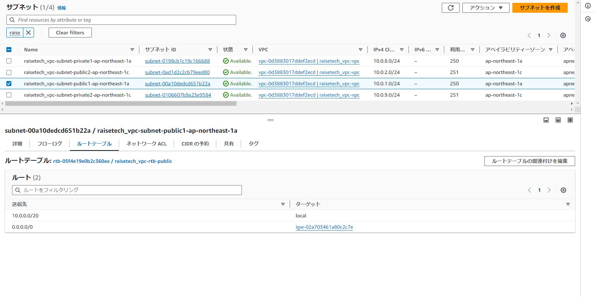

# 第4回課題

## 概要

1. VPCの構築
2. EC2の構築
3. RDSの構築
4. EC2からRDSへの接続確認
5. 感想

## 内容

### 1. VPCの構築

- VPCの構成

- サブネット一覧

- subnet_public1

- subnet_public2

- subnet_private1

- subnet_private2

### 2. EC2の構築

- EC2の構成

- セキュリティグループの詳細

- Teratermからの接続確認

### 3. RDSの構築

- RDSの構成

- セキュリティグループ(インバウンドルール)の詳細

- セキュリティグループ(アウトバンドルール)の詳細

### 4. EC2からRDSへの接続確認

- EC2からRDSへの接続確認

###5. 感想

- 独学で少しVPCやEC2の構築はやっていたので、内容の理解に苦しむことはありませんでした。
  復習の要領で学習を進めていました。
  
- 参考教材としてUdemyの「AWS：ゼロから実践するAmazon Web Services。手を動かしながらインフラの基礎を習得」を視聴しました。