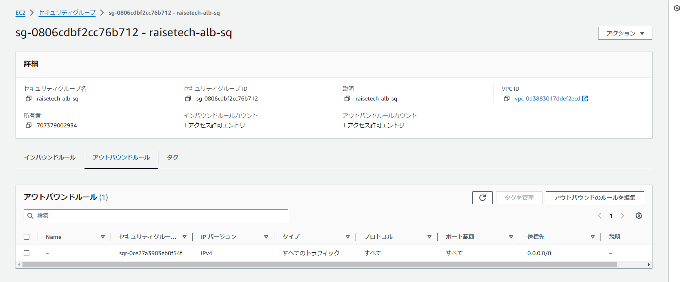

# 第5回課題

## 概要

1. EC2上にサンプルアプリケーションのデプロイと動作確認する
	1. Railsアプリケーションのデプロイ
2. EC2上で、Webサーバー(Nginx)とAPサーバー(Puma)に分離して動作確認する
	1. UnixSocketを使ったPumaの動作確認
	2. Nginxの単体動作確認
	3. NginxとPumaでUnix socketを使った連携動作確認
3. ELB(ALB)を追加して動作確認する
4. S3を追加して動作確認する
5. AWS構成図の作成
6. 感想

## 1. EC2上にサンプルアプリケーションのデプロイと動作確認する

### 1-1. Railsアプリケーションのデプロイ
- パッケージのアップデート
    ```
    sudo yum update
    ```
- rvmをインストール
    ```
    #GPGキーをインストール
    $ gpg2 --keyserver keyserver.ubuntu.com --recv-keys 409B6B1796C275462A1703113804BB82D39DC0E3 7D2BAF1CF37B13E2069D6956105BD0E739499BDB
    
    #rvmをインストール
    $ \curl -sSL https://get.rvm.io | bash -s stable
    
    #.bashrcの末尾に以下を記述
    if [[ -s $HOME/.rvm/scripts/rvm ]] ; then source $HOME/.rvm/scripts/rvm ; fi
    
    #書き換えた内容を反映
    $ sorce ~/.bashrc
    
    #バージョン確認
    $ rvm -v
    rvm 1.29.12 (latest) by Michal Papis, Piotr Kuczynski, Wayne E. Seguin [https://rvm.io]
    ```
- Rubyのインストール
    ```
    $ rvm install ruby-3.2.3
    #バージョン確認
    $ ruby -v
    ruby 3.2.3 (2024-01-18 revision 52bb2ac0a6) [x86_64-linux]
    ```
- bundleのインストール
    ```
    $ gem install bundler -v 2.3.14
    #バージョン確認
    $ bundler -v
    Bundler version 2.3.14
    ```
- railsのインストール
    ```
    $ gem install rails -v 7.1.3.2
    #バージョン確認
    $ rails -v
    Rails 7.1.3.2
    ```
- nvmをインストール
    ```
    $ curl -o- https://raw.githubusercontent.com/nvm-sh/nvm/v0.39.1/install.sh | bash
    $ source ~/.bashrc
    ```
- Node.jsをインストール
    ```
    $ nvm install 17.9.1
    #バージョン確認
    $ node -v
    v17.9.1
    npmのバージョン確認
    $ npm --version
    8.11.0
    ```
- yarnをインストール
    ```
    $ npm install -g yarn@1.22.19
    #バージョン確認
    $ yarn -v
    1.22.19
    ```
- mysql-develをインストール
    ```
    #bundle install時にmysql2をインストールするために必要だった
    $ sudo yum install mysql-devel
    ```
- webpackをインストールする
    ```
    #bin/dev時のエラー対応時にインストールした
    $ npm, install -g webpack
    $ yarn add -D webpack-cli
    ```
- サンプルアプリケーションをクローンする
    ```
    #gitをインストール
    $ sudo yum install git
    #Git cloneする
    $ git clone https://github.com/yuta-ushijima/raisetech-live8-sample-app.git
    ```
- 組み込みサーバーでのRailsアプリケーションの動作確認

    
## 2. EC2上で、Webサーバー(Nginx)とAPサーバー(Puma)に分離して動作確認する

### 2-1. UnixSocketを使ったPumaの動作確認
- パスの変更(config/puma.rb)
    ```
    # port ENV.fetch("PORT") { 3000 }
    bind “Unix:///home/ec2-user/raisetech-live8-sample-app/tmp/sockets/puma.sock
    ```
- PumaとUnix socketを使ったRailsアプリの動作確認
    ```
    $ curl --unix-socket /home/ec2-user/raisetech-live8-sample-app/tmp/sockets/puma.sock http://localhost/
    ```
    
    
### 2-2. Nginxの単体動作確認
- Nginxをインストールして動作確認
    ```
    #nginxのyumを有効化
    $ sudo amazon-linux-extras install nginx1
    #nginxをインストール
    $ sudo yum -y install nginx
    #バージョン確認
    $ nginx -v
    nginx version: nginx/1.22.1
    
    #nginxの起動
    $ sudo systemctl start nginx.service
    ```
- nginxの起動状態確認


- nginxの単体動作確認

    
### 2-3. NginxとPumaでUnix socketを使った連携動作確認
- nginx.confの設定
    ```
    user nginx;
    worker_processes auto;
    error_log /var/log/nginx/error.log;
    pid /run/nginx.pid;

    # Load dynamic modules. See /usr/share/doc/nginx/README.dynamic.
    include /usr/share/nginx/modules/*.conf;

    events {
        worker_connections 1024;
    }

    http {
        log_format  main  '$remote_addr - $remote_user [$time_local] "$request" '
                          '$status $body_bytes_sent "$http_referer" '
                          '"$http_user_agent" "$http_x_forwarded_for"';

        access_log  /var/log/nginx/access.log  main;

        sendfile            on;
        tcp_nopush          on;
        tcp_nodelay         on;
        keepalive_timeout   65;
        types_hash_max_size 4096;

        include             /etc/nginx/mime.types;
        default_type        application/octet-stream;

        # Load modular configuration files from the /etc/nginx/conf.d directory.
        # See http://nginx.org/en/docs/ngx_core_module.html#include
        # for more information.
        include /etc/nginx/conf.d/*.conf;

        upstream puma {
            server unix:///home/ec2-user/raisetech-live8-sample-app/tmp/sockets/puma.sock;
        }
        server {
            listen       80 default_server;
            listen       [::]:80 default_server;
            server_name  18.179.45.164;
            root         /home/ec2-user/raisetech-live8-sample-app/public;

            location / {
                try_files $uri $uri/index.html $uri.html @puma;
            }

            location @puma {
                #proxy_read_timeout 300;
                #proxy_connect_timeout 300;
                proxy_redirect off;
                proxy_set_header X-Forwarded-Proto $scheme;
                proxy_set_header Host $http_host;
                proxy_set_header X-Real-IP $remote_addr;
                proxy_pass http://puma;
            }

            error_page 404 /404.html;
                location = /40x.html {
            }

            error_page 500 502 503 504 /50x.html;
                location = /50x.html {
            }
        }
    }
    ```
- raisetech-live8-sample-app.confの設定
    ```
      # log directory
      error_log  /home/ec2-user/raisetech-live8-sample-app/log/error.log;
      access_log /home/ec2-user/raisetech-live8-sample-app/log/access.log;

      upstream app_server {
        # for UNIX domain socket setups 
       server unix:/home/ec2-user/raisetech-live8-sample-app/tmp/sockets/puma.sock fail_timeout=0;
      }
      server {
        listen 80;
        server_name _; #publicIP

        # nginx so increasing this is generally safe...
        # path for static files
        root /home/ec2-user/raisetech-live8-sample-app/public;

        # page cache loading
        try_files $uri/index.html $uri @app_server;

        location / {
          # HTTP headers
          proxy_pass http://app_server;
          proxy_set_header X-Forwarded-For $proxy_add_x_forwarded_for;
          proxy_set_header Host $http_host;
          proxy_redirect off;
        }

        # Rails error pages
        error_page 500 502 503 504 /500.html;

        location = /500.html {
          root /home/ec2-user/raisetech-live8-sample-app/public;
        }

        client_max_body_size 4G;
        keepalive_timeout 5;
      }
    ```
- NginxとPumaの連携動作確認


## 3. ELB(ALB)を追加して動作確認する
- ALBの作成

- セキュリティグループ
    - インバウンドルール
    

    - アウトバンドルール
    
    
- ターゲットグループ


- ALBのDNS名から接続して動作確認


## 4. S3を追加して動作確認する
- S3バケットの作成


- IAMポリシー作成(S3へのアクセス権限)


- IAMロール作成(EC2に対してS3への権限付与)


- EC2にIAMロールをアタッチ


- 動作確認


- オブジェクトが保存されていることの確認


## 5. AWS構成図の作成


## 6. 感想
- 手順を考えて実行しても、思った通りにはいかずエラー対応も最初はどこを見ればいいのかも分かりませんでした。
原因を調べて何をすればいいのかを究明することに最も時間を使いましたが、その分、力が付いたのではと感じました。
- それでも、まだ理解しきれていない部分もあるのでこれからも知識の習得に励もうと思いました