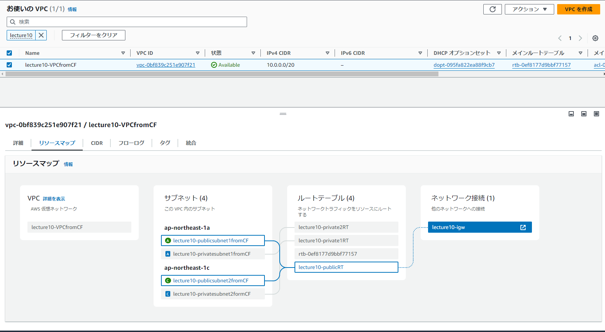
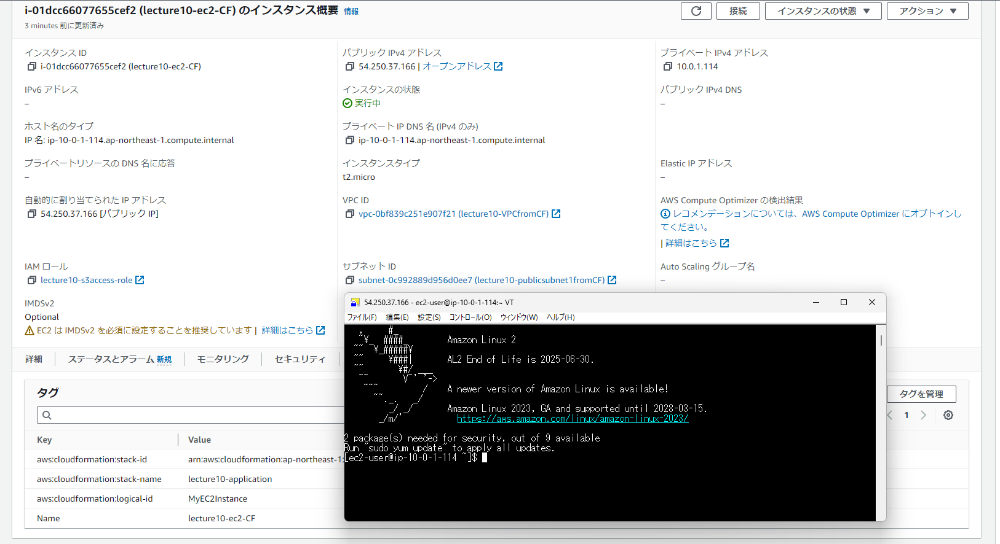
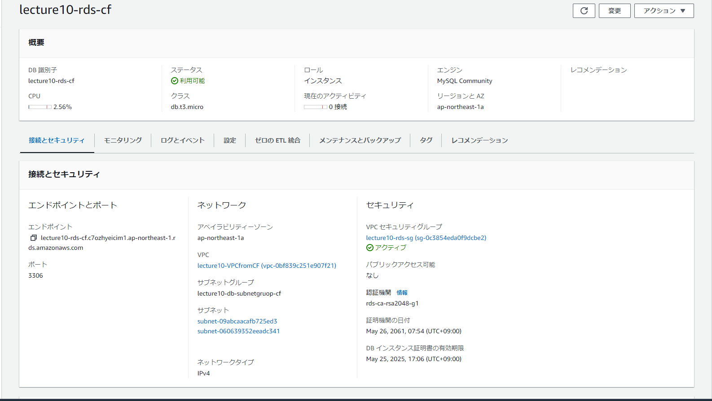
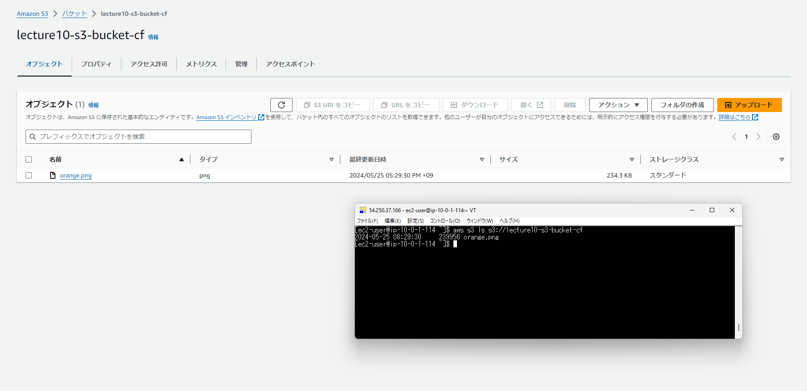
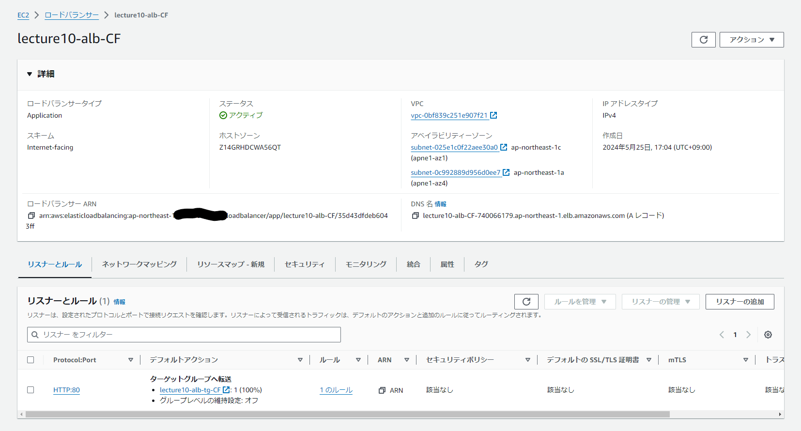
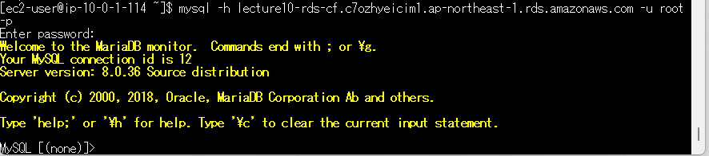

### 第10回課題

## 概要
1. テンプレートファイル
2. VPC構築結果
3. EC2構築結果
4. RDS構築結果
5. S3構築結果
6. ALB構築結果
7. EC2からRDSへの接続結果
8. 感想

## 1.テンプレートファイル
- [**network_raisetech.yml**](cloudformation/network_raisetech.yml)
- [**security_raisetech.yml**](clopudformation/security_raisetech.yml)
- [**application_raisetech.yml**](cloudformation/application_raisetech.yml)

## 2.VPC構築結果
- VPC

## 3.EC2構築結果
- EC2

## 4.RDS構築結果
- RDS

## 5.S3構築結果
- S3

## 6.ALB構築結果
- ALB

## 7.EC2からRDSへの接続結果
- 接続結果

## 8.感想
- コード化する上で、各AWSサービスのPropertiesでどんな設定を記載すればいいのかを公式ドキュメントを主に参考にして進めました。
- コンソール画面で構築を行うよりも、他のサービスの論理IDを参照したり、汎用的な設定をしたり、記述ミスでスタック作成でエラーが起きたりなどコード化ならではの大変さがありましたが、その分理解が深まりました。
