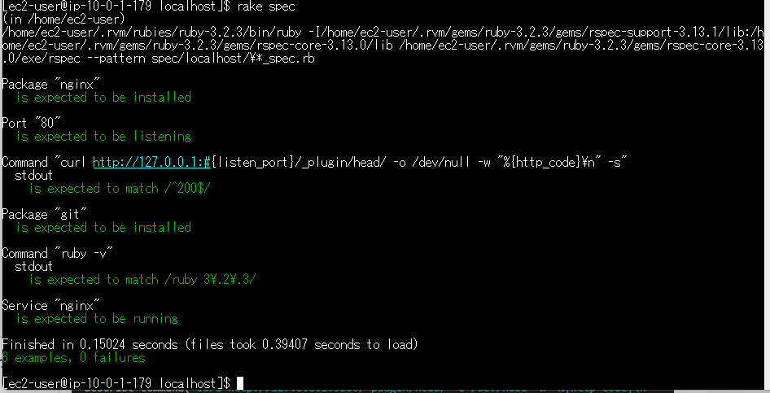

# 第11回課題

## 概要
1. Serverspecをインストールする
2. テストが成功することを確認する
3. 感想

## 1. Serverspecをインストールする
- Serverspecをインストールする
  ```
  $ gem install serverspec
  ```
 - 設定ファイルを作成する
    ```
    $ serverspec-init
    ```
- sample_spec.rbに追加テストを記述
    ```
    require 'spec_helper'
    
    #ポート80番を指定
    listen_port = 80

    # nginxがインストールされているかを確認
    describe package('nginx') do
    it { should be_installed }
    end

    # 指定されたポートが待ち状態になっているかを確認
    describe port(listen_port) do
    it { should be_listening }
    end
    
    # 指定されたポートに対して、HTTPリクエストを送信して200を返すかを確認
    describe command('curl http://127.0.0.1:#{listen_port}/_plugin/head/ -o /dev/null -w "%{http_code}\n" -s') do
    its(:stdout) { should match /^200$/ }
    end
    
    # 追加テスト
    # gitがインストールされているかを確認
    describe package('git') do
    it { should be_installed }
    end
    
    # rubyが指定のバージョンでインストールされているかを確認
    describe command('ruby -v')do
    its(:stdout) { should match /ruby 3\.2\.3/ }
    end

    # nginxが起動していることを確認
    describe service('nginx')do
    it { should be_running}
    end
    ```
    
## 2. テストが成功することを確認する
- テストを実行する
    ```
    $ rake spec
    ```
    
- テスト結果


## 3. 感想
- Serverspecの設定ファイルの作成場所を最初サンプルアプリ内で作成してしまったのでテストできないことがありました。
- きちんとツールの目的を理解して、どのディレクトリに設定ファイルを作成すればいいのかを把握してから作業しないといけないと感じました。
