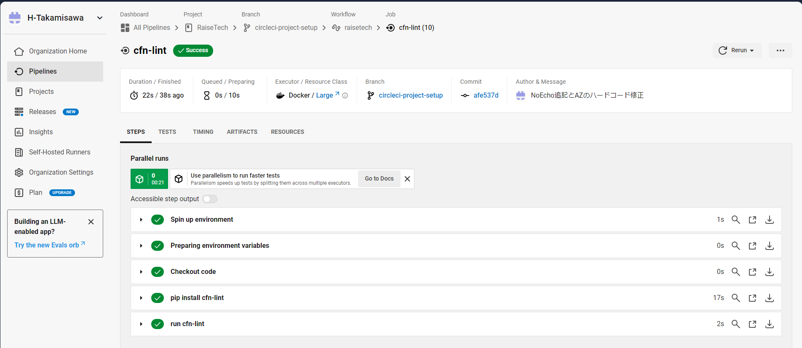

# 第12回課題

## 概要
1. CircleCIのサンプルコンフィグが正しく動作するようにリポジトリに組み込む
2. 感想

## 1. CircleCIのサンプルコンフィグが正しく動作するようにリポジトリに組み込む
- cfn-lintというジョブが成功したことを確認した。

## 2. 感想
- CircleCIにより自動的にCloudFormationのymlファイルのコードチェックができることを実感しました。
- cloudformationのテンプレートでNoEchoやアベイラビリティーゾーンのハードコードをしないでGetAZs組み込み関数を使うことを知ることができました。このようにして人為的なミスを防いでいくというツールのメリットを実感することができました。
