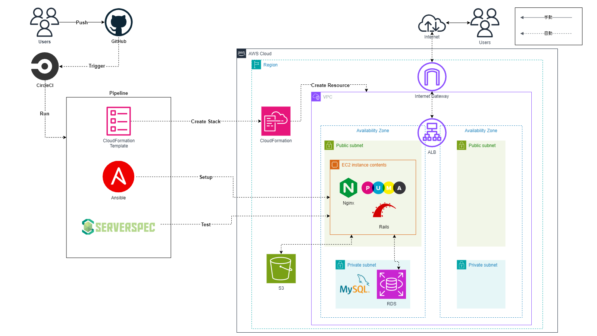
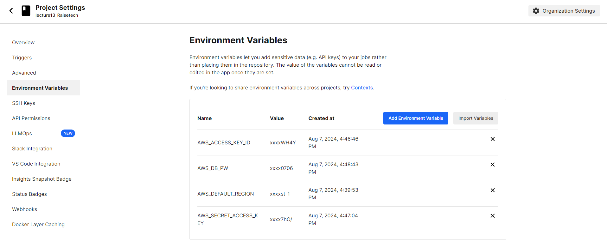
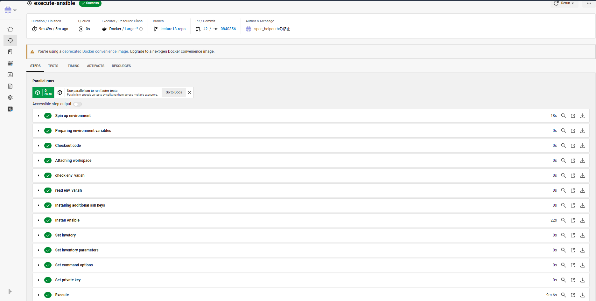
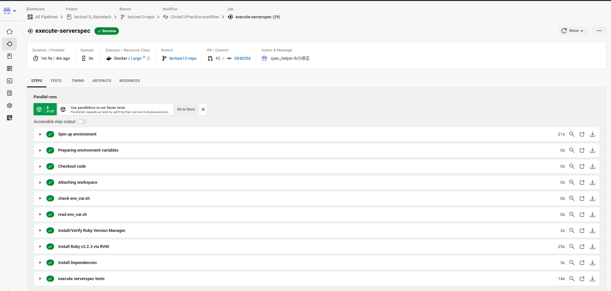
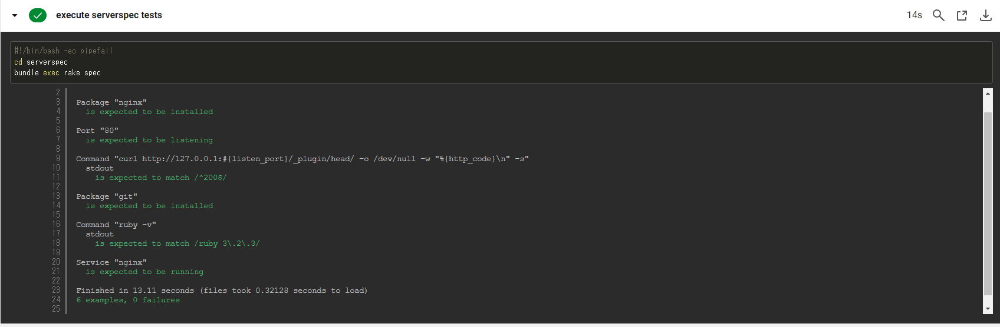
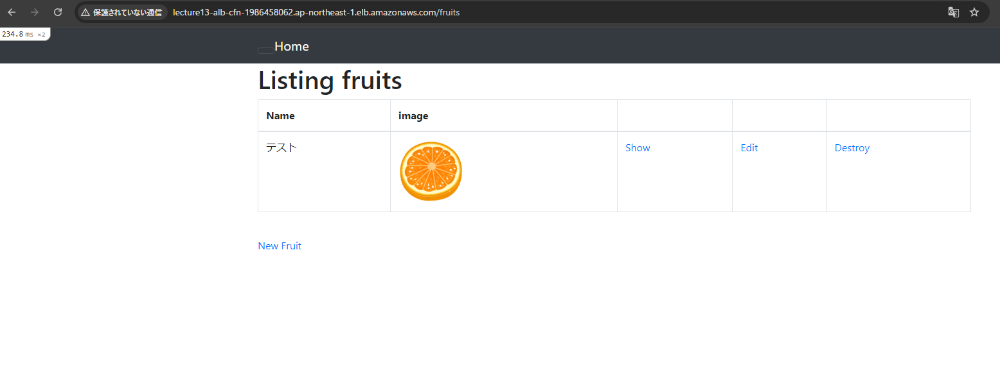

# 第13回課題

## 概要
1. CircleCIのサンプルにServerspecやAnsibleの処理を追加する
2. 感想

## 1. CircleCIのサンプルにServerspecやAnsibleの処理を追加する
- 第13回課題で作成したコード等の詳細については[第13回課題リポジトリ](https://github.com/H-Takamisawa/lecture13_Raisetech)を参照してください。

- 今回の課題で作成した構成図は以下の通りです。
 

### 1.1 CircleCIで環境変数を設定する
- AWS_ACCESS_KEY_ID
- AWS_SECRET_ACCESS_KEY
- AWS_DEFAULT_REGION
- AWS_DB_PW
 

### 1.2 Cloudformationのスタック作成処理を実行
- 実行結果
 
 
### 1.3 Ansibleの処理を実行
- 実行結果
 
 
### 1.4 serverspecの処理を実行
- 実行結果
 

- テスト結果
 

### 1.5 Railsアプリの動作確認
 

## 2. 感想
- CircleCIでインフラの自動構築から構成設計、自動テストまでの処理を作成しました。
- Ansibleのプレイブック作成においては、冪等性を保証するために、どのようなタスクを作成したらいいのかを考えて実装することが大変でした。
- CircleCIでリソースを自動構築し、Ansibleやserverspecで利用するEC2のIPアドレスやALBのDNS名などを動的に取得する方法に苦戦しました。
- 構文エラーやスペルミスなどが原因のエラーが多かったので、コードの記述の際は注意しなければと感じました。また、VsCodeの拡張機能などで視覚的に分かるように環境を整えることも大切だと感じました。
